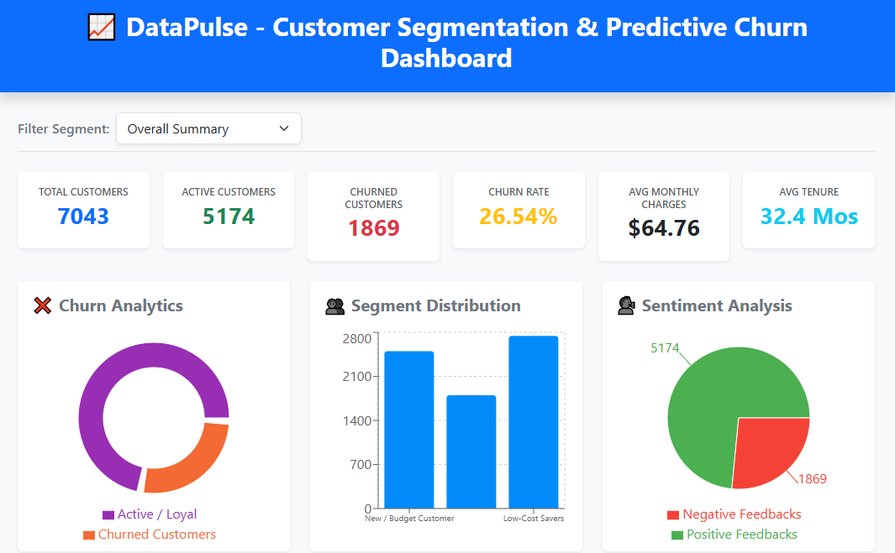
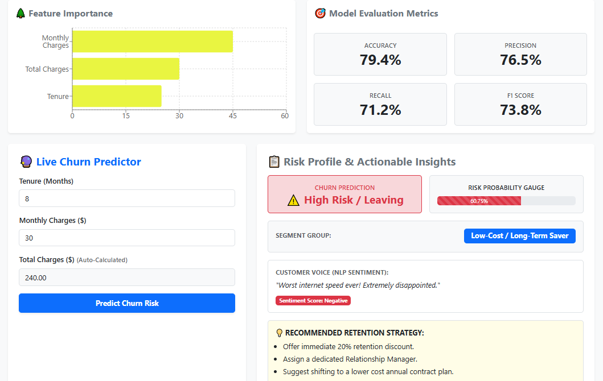
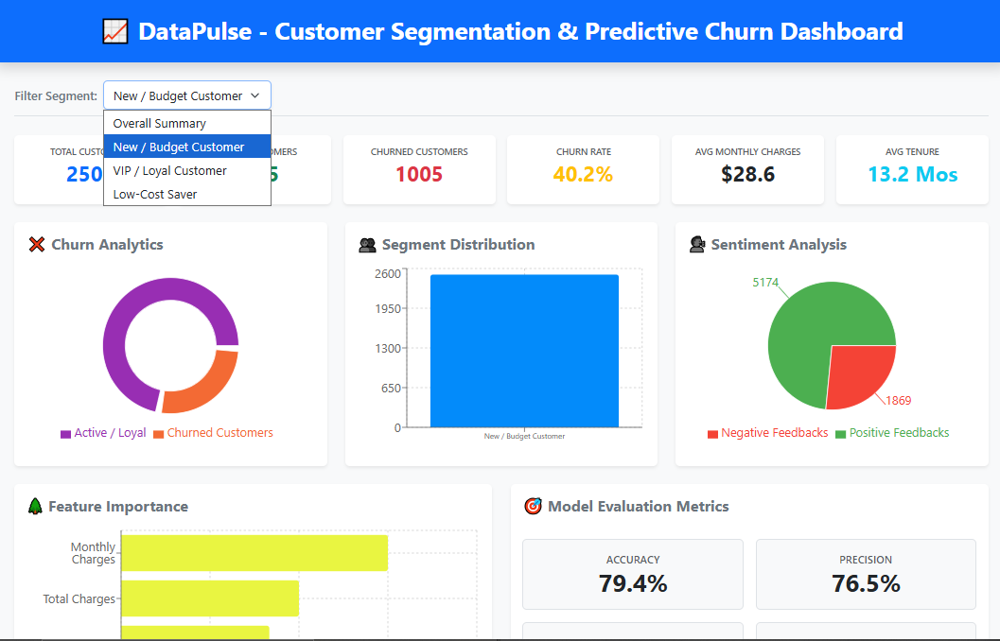

# DataPulse: Customer Segmentation & Predictive Churn Dashboard 📊🚀

DataPulse is an end-to-end machine learning web application that predicts customer churn and segments customers based on behavioral patterns. The application combines a React.js frontend, FastAPI backend, and Scikit-learn models to provide real-time predictions, business analytics, and customer insights.
The predictive core utilizes **Scikit-Learn** models to classify customer churn risk and group customers into behavioral segments using the standard Telco Customer Churn dataset (7,043+ records).

## 🌐 Live Demo

**Frontend:** https://datapulse-frontend-v1.onrender.com

**Backend API:** https://datapulse-backend-0veu.onrender.com


## 📸 Screenshots






## 🌟 Key Features

* **Interactive KPI Dashboard:** Real-time visualization of key performance indicators (Accuracy, Precision, Recall, F1-Score).
* **Live Churn Predictor:** Form interface to input customer parameters (Tenure, Monthly Charges, Total Charges) and dynamically obtain churn risk probability.
* **Customer Segmentation:** Automated grouping of customers into distinct segments (`New / Budget Customer`, `VIP / Loyal Customer`, `Low-Cost / Long-Term Saver`) using K-Means Clustering.
* **Sentiment & Retention Insights:** Simulates customer sentiment and maps out automated actionable business retention strategies based on churn risk.
* **Feature Importance & Visualization:** Visual distribution graphs highlighting critical analytical weights (Monthly Charges, Total Charges, Tenure).


## 🛠️ Tech Stack

### Frontend
* React.js, JavaScript (ES6+), HTML5, CSS3
* **Visualization:** Custom interactive charts and Recharts

### Backend
* **Framework:** Python FastAPI
* **Server:** Uvicorn ASGI Server
* **Validation:** Pydantic 

### Machine Learning
* **Libraries:** Scikit-Learn, Pandas, NumPy, NLTK
* **Models:** 
  * Random Forest Classifier (for Churn Prediction)
  * K-Means Clustering (for Customer Segmentation)
  * Standard Scaler (for Feature Normalization)

### DevOps & Cloud Deployment
* **Containerization:** Docker & Multi-stage builds
* **Registry:** Docker Hub
* **Hosting Platform:** Render 


## 🏗️ System Architecture (Data Flow)

```
React.js Dashboard
       │
       ▼ 
REST API (FastAPI) 
       │
       ▼
Preprocessing (StandardScaler)
       │
       ▼
Random Forest
       │
       ▼
    KMeans
       │
       ▼
JSON Response
       │
       ▼
React Dashboard
```

## 📈 Model Performance 

* **Dataset Size:** 7,043 Customer Records (Telco Customer Churn)
* **Model Accuracy:** `79.4%`
* **Model F1-Score:** `73.8%`
* **Model Precision:** `76.5%`
* **Model Recall:** `71.2%`


## 🔌 API Endpoints

### 1. Get Analytics Summary
**Endpoint:** `GET /api/analytics`
**Description:** Returns dashboard analytics, KPI metrics, and customer insights for visualization.

### 2. Predict Customer Churn
**Endpoint:** `POST /api/predict`
**Description:** Accepts customer details and returns churn prediction, churn probability, customer segment, sentiment analysis, and personalized business recommendations.

#### Request Body
```json
{
  "tenure": 12,
  "MonthlyCharges": 64.5,
  "TotalCharges": 774.0
}
```

#### Response Body
```json
{
  "churn": "No",
  "churn_probability": 15.4,
  "customer_segment": "Low-Cost / Long-Term Saver",
  "sentiment_label": "Positive",
  "recommendations": [
    "Loyal customer. Eligible for premium plan upsell.",
    "No immediate risk."
  ]
}
```
## 🚀 Local Setup & Installation
1. **Clone the Repository**
```
git clone https://github.com/rashijaiswal22/Data_Pulse.git
```
2. **Backend**
```
cd backend
pip install -r requirements.txt
uvicorn app:app --reload
```
3. **Frontend**
```
cd ../frontend
npm install
npm start
```


## 📁 Project Structure

```
customer-segmentation/
│
├── backend/
│   ├── models/                  # ML Artifacts (.pkl files)
│   │   ├── kmeans_models.pkl
│   │   ├── random_forest.pkl
│   │   └── scaler.pkl
│   ├── app.py                   # FastAPI Application Entrypoint
│   ├── requirements.txt         # Python Dependencies
│   └── Dockerfile               # Backend Docker Configuration
│
├── frontend/
│   ├── src/
│   │   ├── components/
│   │   │   └── DashBoard.js     # React Dashboard UI & Fetch Requests
│   │   ├── App.js
│   │   └── index.js
│   ├── package.json             # Node Dependencies
│   └── Dockerfile               # Frontend Docker Configuration
│
└── data/
    └── WA_Fn-UseC_-Telco-Customer-Churn.csv  # Dataset file (ignored on Git)
```
## 📂 Dataset

This project uses the **Telco Customer Churn** dataset.
The dataset is not included in this repository. Please download it from Kaggle and place it inside the `data/` directory before running the project.

